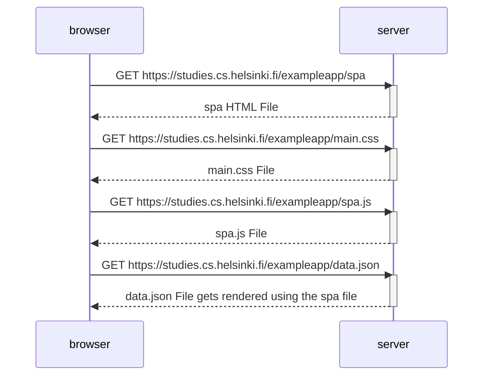

```mermaid
sequenceDiagram
    participant browser
    participant server

    browser->>server: GET https://studies.cs.helsinki.fi/exampleapp/spa

    activate server
    server-->>browser: spa HTML File
    deactivate server

    browser->>server: GET https://studies.cs.helsinki.fi/exampleapp/main.css

    activate server
    server-->>browser: main.css File
    deactivate server

    browser->>server: GET https://studies.cs.helsinki.fi/exampleapp/spa.js

    activate server
    server-->>browser: spa.js File
    deactivate server

    browser->>server: GET https://studies.cs.helsinki.fi/exampleapp/data.json

    activate server
    server-->>browser: data.json File gets rendered using the spa file

    deactivate server
```
